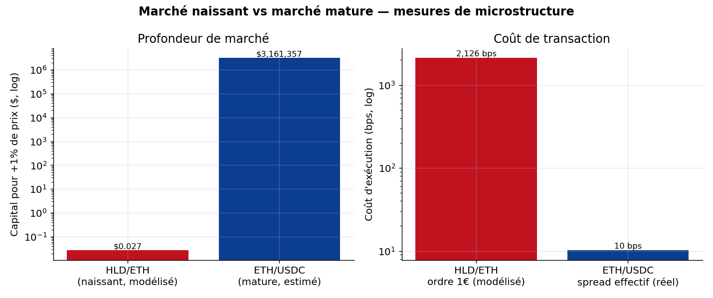
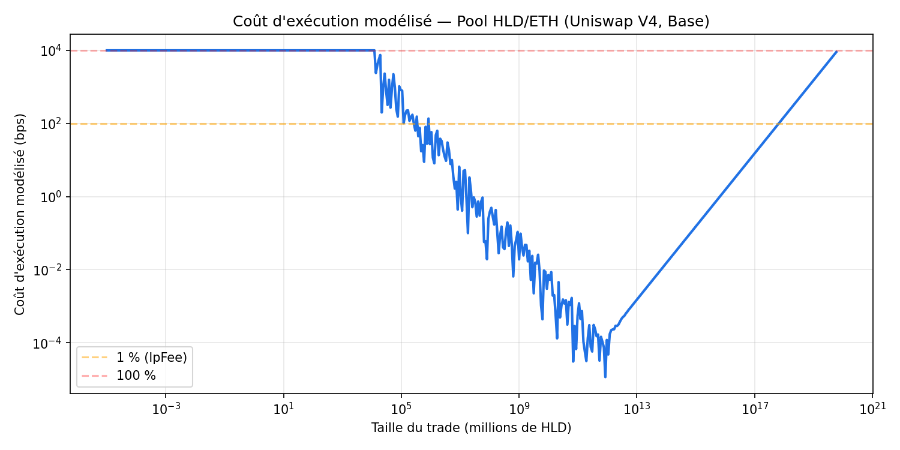
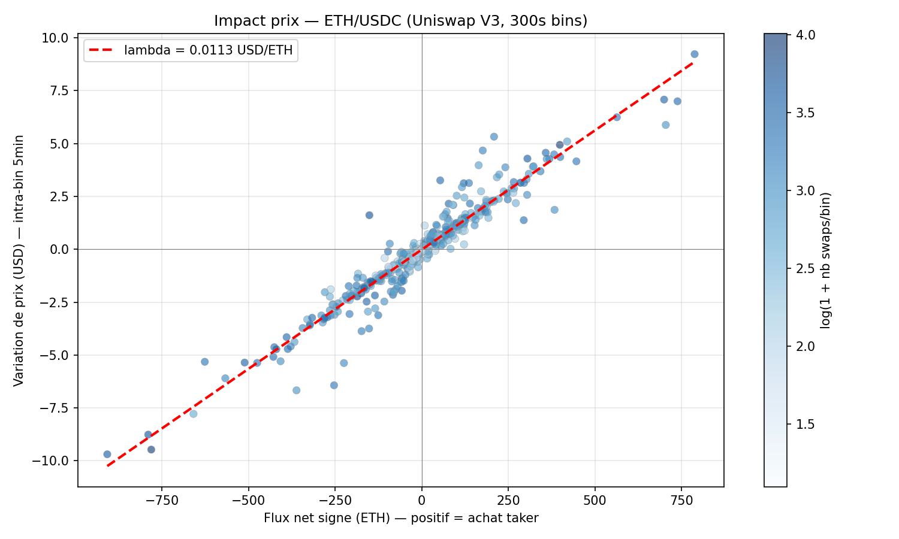

# On-Chain Market Microstructure — A Nascent AMM Pool vs a Mature Market

**Comparative microstructure study of two Automated Market Maker (AMM) regimes:** a freshly
deployed, illiquid token pool (HLD/ETH on Uniswap V4, Base) analysed **analytically**, versus a
deep, actively-traded pool (ETH/USDC on Uniswap V3, Ethereum) analysed **econometrically on
6,737 real swaps**.

> **Français :** voir [README.fr.md](README.fr.md) · **Full report (PDF):** [report/rapport.pdf](report/rapport.pdf)

 -success) 

---

## TL;DR

- **Research question:** How do you *measure the maturity* of an AMM market, and where does a
  newborn token sit on that axis?
- **Two regimes, two honest methods:** the newborn pool has **no trades**, so it is characterised
  **analytically** (AMM model); the mature pool has thousands of trades, so it is **estimated**
  from real data. We only estimate where data exists.
- **Headline results (real, on-chain):**
  - Moving the price **+1%** costs **~$0.03** on HLD vs **~$3.2M** on ETH/USDC → a **~10⁸** depth gap.
  - **Kyle's price-impact λ** on ETH/USDC estimated at **0.011 $/ETH²** (t = 317, R² = 0.94) on
    **6,737 real swaps** → near-zero impact, a deep market.
  - A **€1** buy on HLD incurs a **~2,100 bps** modelled execution cost; ETH/USDC's real effective
    spread is **~10 bps**.

---

## Why this project

Newly-created tokens have no price history and negligible liquidity, so the classical toolkit
(returns, volatility, GARCH, cross-asset correlation) is **not identifiable** — observed prices are
the noise of a handful of trades. Instead of forcing those tools onto meaningless data, this
project studies **market structure**, and contrasts the newborn pool against a mature benchmark to
put the numbers in perspective. This mirrors what a microstructure / execution desk actually does.

---

## What's inside (skills demonstrated)

| Area | What was done |
|---|---|
| **On-chain data engineering** | Read a Uniswap V4 pool's raw state from the Singleton `PoolManager` via `extsload` — deriving the `poolId` (keccak256), locating the storage slot, decoding the packed `Slot0`. No public getter exists. |
| **AMM microstructure modelling** | Constant-product model → slippage, market depth, impermanent loss, execution cost. |
| **Econometrics on real data** | Extracted **6,737** Uniswap V3 `Swap` events; estimated **Kyle's λ**, realised volatility and effective spread (OLS, t-stats, R²). |
| **Reproducibility** | Live extraction scripts, validated estimator module, executed notebook, PDF report. |

---

## Key results

### Comparative grid

| Measure | HLD/ETH — nascent (modelled) | ETH/USDC — mature (estimated) |
|---|---|---|
| Liquidity / TVL | ≈ $10 | deep (multi-$M) |
| Observed transactions | ≈ 0 | 6,737 in 36 h |
| Cost of a small order | €1 → ~2,100 bps | ~10 bps (real effective spread) |
| Capital to move price +1% | ≈ $0.03 | ≈ $3.2M |
| Kyle's price impact (λ) | not estimable (no flow) | 0.011 $/ETH² (t = 317, R² = 0.94) |
| Realised volatility | not identifiable | 24.2% annualised |



### Nascent pool — modelled execution cost (HLD/ETH)



### Mature pool — estimated price impact, Kyle's λ (ETH/USDC)



---

## Data provenance (honesty first)

- **HLD/ETH:** live on-chain state read at **Base block #49,023,454 (2026-07-23)**. Decoded virtual
  reserves (0.003 ETH / 65,992,981 HLD) match the pool's real composition.
- **ETH/USDC:** **6,737 real `Swap` events** over a 36.2 h window (mean price $1,881.68/ETH).
- **Modelled vs estimated:** HLD slippage figures are **modelled** (constant-product) on real
  reserves — *not* observed trades. ETH figures are **estimated** on **real** observed swaps. The
  two vocabularies are never mixed.
- EUR conversions use the real ETH/EUR of the extraction day (€1,645.88).

---

## Repository structure

```
├── README.md / README.fr.md        # this file (EN) + French version
├── report/rapport.pdf              # full report
├── extract_live.py                 # live HLD/ETH pool-state extraction (extsload)
├── src/
│   ├── onchain.py                  # poolId, storage slot, Slot0 decoding
│   ├── amm.py                      # constant-product model (slippage, depth, IL)
│   ├── microstructure.py           # Kyle's lambda, realised vol, effective spread (validated)
│   ├── extract_eth_swaps.py        # ETH/USDC Swap-event extraction
│   └── plots.py                    # regenerates figures
├── notebooks/analysis.ipynb        # end-to-end, executed
├── data/                           # pool_state.json, eth_swaps.csv, eth_microstructure.json
└── figures/                        # generated charts
```

## Reproduce

```bash
pip install -r requirements.txt
python extract_live.py                 # HLD/ETH pool state (needs a Base RPC)
python src/extract_eth_swaps.py        # ETH/USDC real swaps (needs an Ethereum RPC)
python src/microstructure.py           # validate estimators (self-test)
python src/plots.py                    # regenerate figures
jupyter notebook notebooks/analysis.ipynb
```

## Limitations

Constant-product is a local approximation of V4 concentrated liquidity; HLD execution cost is
modelled, not observed; the linear extrapolation of Kyle's lambda to a 1% move is an
order-of-magnitude estimate; the ETH estimation covers a 36 h window. See the report for full
discussion.

---

*Author: **Gianni Pilotti** — Economics & Finance student, University of Luxembourg.
Market-finance / quantitative trading portfolio project. Not investment advice.*
